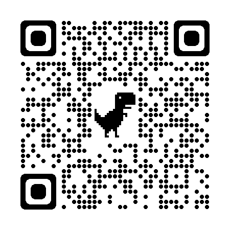

## Casa do Barista
O site Casa do Barista é uma plataforma web institucional desenvolvida com foco em design responsivo e experiência imersiva.

## Tecnologias Utilizadas
- HTML5
- CSS3
- Bootstrap 5
- JavaScript
- JQuery
- Slick.js

## Funcionalidades
- Página inicial com banner carrosel;
- Efeito parallax nas seções;
- Galeria de imagens carrosel;
- Seção com depoimento de clientes;
- Modal notificando que as redes sociais são fictícias;
- Rodapé informativo.

  ## Esse site é responsivo!
  <b> Escaneie o QrCode e veja pelo seu dispositivo movel! </b> 
 
  
